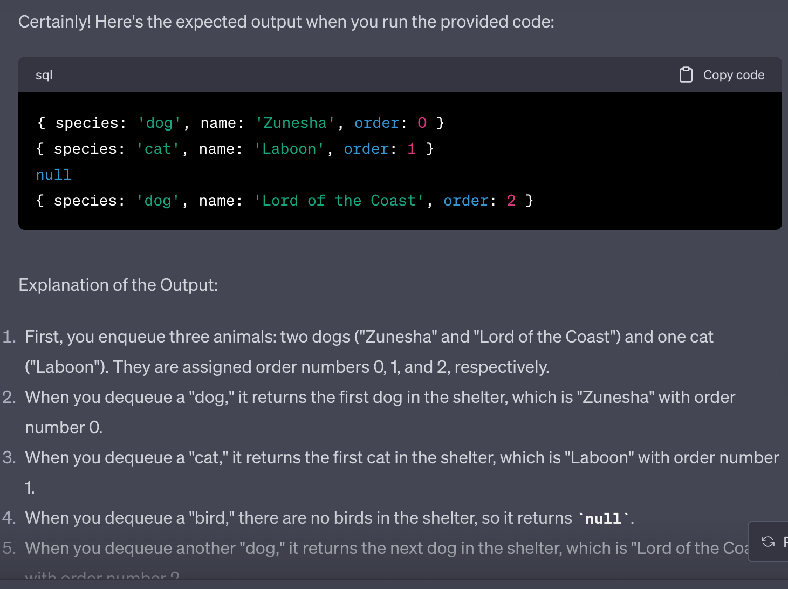
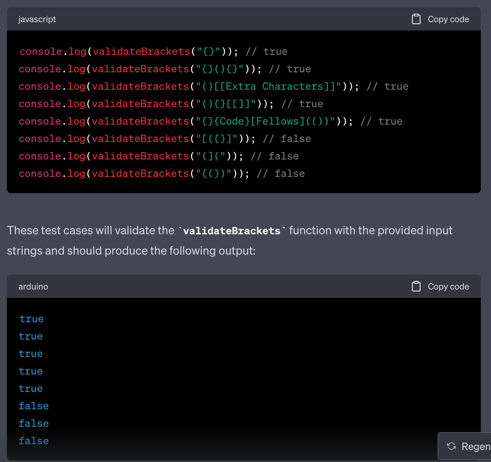
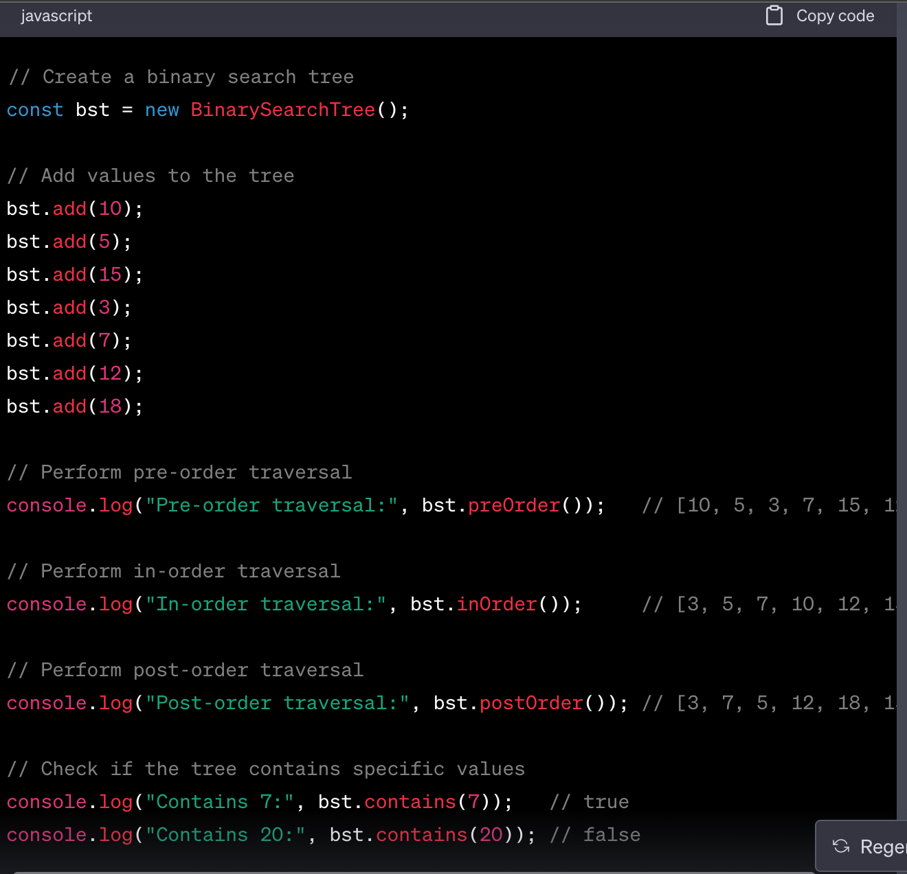
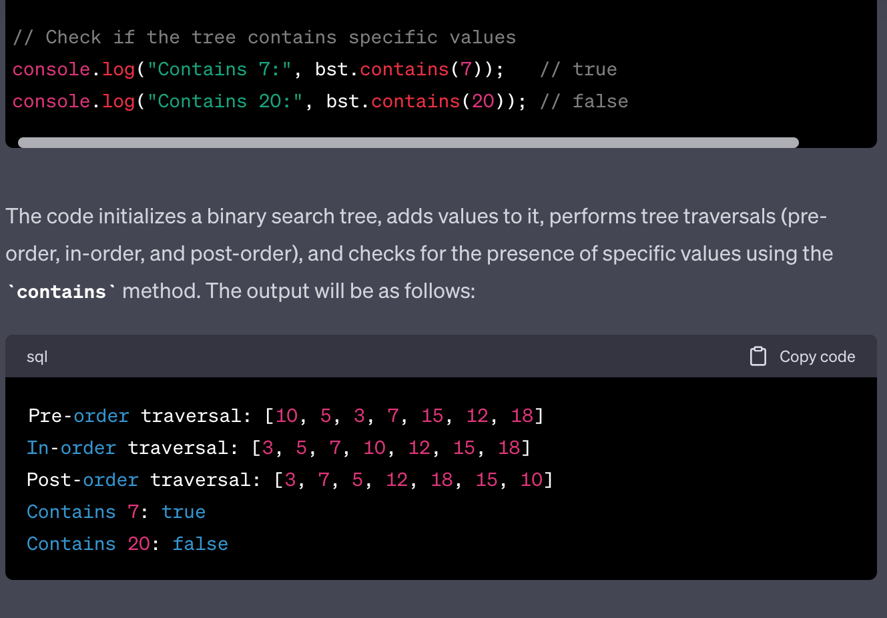

## Table of Contents

- [Code 1](#code-1-reversearray)
- [Code 2](#code-2-arrayinsertshift)
- [Code 3](#code-3-binarysearch)
- [Code 5](#code-5-singly-linked-lists)
- [Code 7](#code-7-k-th-value)
- [Code 8](#code-8-zip-two-linked-lists)
- [Code 10](#code-10-stacks-and-queues)
- [Code 11](#code-11-stacks-and-queues-pseudo-queue)
- [Code 12](#code-12-stacks-and-queues-animal-shelter)
- [Code 13](#code-13-stacks-and-queues-brackets)
- [Code 14](#code-13-stacks-and-queues-binarytree)

# Code 1: ReverseArray

## Whiteboard Process

## Approach & Efficiency

- Approach: The approach taken is an iterative one, which reverses an array by creating a new array and adding elements from the input array in reverse order.

- Why: This approach was chosen because it adheres to the challenge requirement of not using built-in methods and is straightforward to implement.

- Big O Time Complexity: The time complexity is O(n) because it iterates through the input array once, performing a constant-time operation for each element.

- Big O Space Complexity: The space complexity is also O(n) because it creates a new array to store the reversed elements, with space proportional to the size of the input array.

## Solution

# Code 2: ArrayInsertShift

## Whiteboard Process

## Approach & Efficiency

- Approach:
  - Calculate the middle index of the input array.
  - Initialize a new result array.
  - Iterate through the original array and insert elements into the result array, adding the new value at the middle index.
  - Return the result array as the output.

- Why:
  - This approach was chosen because it allows us to insert a value into the middle of the array without using built-in methods, such as splice, which can directly add elements at a specified position.

- Big O Time Complexity:
  - Time Complexity: O(n), where n is the number of elements in the input array. We iterate through the input array once to copy its elements into the result array. The calculation of the middle index takes constant time.

- Big O Space Complexity:
  - Space Complexity: O(n) as well. We create a new result array that can potentially contain all elements of the input array plus one additional element (the new value). Therefore, the space required is proportional to the size of the input array. The calculation of the middle index and other variables have constant space overhead.

## Solution

# Code 3: BinarySearch

## Whiteboard Process

## Approach & Efficiency

- Approach:
  - The approach taken here is the Binary Search algorithm.

- Why:
  - This algorithm is used because it efficiently searches a sorted array by repeatedly dividing the search space in half, reducing the time complexity significantly compared to linear search.

- Big O Time Complexity:
  - Binary search efficiently narrows down the search space by half with each comparison.

- Big O Space Complexity:
  - Binary search uses a constant amount of extra space for variables, making it space-efficient.

## Solution

# Code 3: BinarySearch

## Whiteboard Process

## Approach & Efficiency

- Approach:
  - The approach taken here is the Binary Search algorithm.

- Why:
  - This algorithm is used because it efficiently searches a sorted array by repeatedly dividing the search space in half, reducing the time complexity significantly compared to linear search.

- Big O Time Complexity:
  - Binary search efficiently narrows down the search space by half with each comparison.

- Big O Space Complexity:
  - Binary search uses a constant amount of extra space for variables, making it space-efficient.

## Solution

# Code 5: Singly Linked Lists

## Whiteboard Process

## Approach & Efficiency

- Approach:
  - LinkedList Class:
    - Implemented a singly linked list with a head property.
  - Insertion (insert method):
    - Added new nodes to the head of the list for O(1) time complexity.
  - Search (includes method):
    - Used linear search to check for value existence, resulting in O(n) worst-case time complexity.
  - String Representation (toString method):
    - Constructed a human-readable string representation of the linked list for visualization.

- Why:
  - Insertion at the Head:
    - Chose insertion at the head for O(1) time complexity.
  - Linear Search for Inclusion:
    - Linear search ensures examining each node once for value existence.
  - String Representation:
    - Built a clear and concise string for easier debugging.

- Big O Time Complexity:
  - `insert` method: O(1)
  - `includes` method: O(n) (worst-case), O(1) (best-case)
  - `toString` method: O(n)

- Big O Space Complexity:
  - The space complexity of this implementation is O(n), where n is the number of nodes in the linked list. This space is primarily used for storing the nodes themselves, and the space complexity does not depend on the number of operations performed on the linked list.

## Solution
[Code](code-challenges/LinkedList.js)

# Code 7: k-th value

## Whiteboard Process

## Approach & Efficiency

- Approach:
  The kthFromEnd method uses two pointers, a slow pointer and a fast pointer, to find the kth node from the end of the linked list. The approach involves iterating through the linked list using these pointers in a way that ensures the desired result is obtained efficiently.

  - Initialize both the slow and fast pointers to the head of the linked list.

  - Move the fast pointer k nodes ahead of the slow pointer. This is done by iterating over the list with the fast pointer.

  - After the fast pointer has been moved k nodes ahead, iterate both the slow and fast pointers simultaneously until the fast pointer reaches the end of the list. This ensures that the slow pointer will be at the kth node from the end when the fast pointer reaches the end.

  - Return the value of the node pointed to by the slow pointer, which represents the kth node from the end.

- Why:
  This approach is efficient because it requires only one pass through the linked list, with both the slow and fast pointers moving at different speeds. The fast pointer moves k nodes ahead, and then both pointers move together until the end of the list is reached. This ensures that the slow pointer is always positioned at the kth node from the end when the fast pointer reaches the end.

- Big O Time Complexity:
  The time complexity of this approach is O(n), where n is the number of nodes in the linked list. This is because we iterate through the list once, and the number of iterations is proportional to the length of the list.

- Big O Space Complexity:
  The space complexity is O(1) because we use a constant amount of extra space for the two pointers regardless of the size of thc e linked list.

## Solution
[Code](code-challenges/kthFromEnd.js)

# Code 8: Zip two linked lists

## Whiteboard Process

## Approach & Efficiency

- Approach:
  1. Initialize a dummy node dummy and a current pointer to it.
  2. Use a loop that continues until either list1 or list2 is not empty.
  3. Inside the loop, if list1 has elements, attach the head of list1 to the current.next node and move list1.head to the next node.
  4. If list2 has elements, do the same for list2.
  5. This process alternates between adding nodes from list1 and list2 to the result list.
  6. Create a new LinkedList called newList with newList.head set to dummy.next, which is the merged list.
  7. Return newList.

- Why:
  This approach is used because it efficiently combines the two input lists into a new list with minimal additional space usage and a linear time complexity. It utilizes a dummy node to simplify the merging process and maintains a current pointer to build the merged list step by step. By alternating between list1 and list2, it ensures that nodes from both lists are included in the merged result, making it a straightforward and efficient way to zip two linked lists together.

- Big O Time Complexity:
  The time complexity of this zipLists function is O(N), where N is the total number of nodes in both list1 and list2. This is because the function iterates through both lists once and combines them into a new list, which takes linear time.

- Big O Space Complexity:
  The space complexity is O(1) for auxiliary space because the function does not use any additional data structures that scale with the size of the input lists. It only uses a constant amount of extra space for variables like dummy and current.

## Solution
[Code](code-challenges/zipList.js)

# Code 10: Stacks and Queues

## Whiteboard Process

## Approach & Efficiency

- Approach:
  Implemented using a singly linked list, where each new element is added to the rear of the queue (enqueue) and removed from the front (dequeue). This linked list approach also enables constant-time operations (O(1)) for both enqueue and dequeue.

- Why:
  Queues are commonly used for managing data in a first-in-first-out (FIFO) manner, like in task scheduling or breadth-first searches.

- Big O:
  enqueue: O(1) - Adding an element to the rear of the queue takes constant time, involving creating a new node and updating references.
  dequeue: O(1) - Removing the front element from the queue also takes constant time, as it only requires updating references.
  peek: O(1) - Peeking at the front element involves accessing the front node's value directly.
  isEmpty: O(1) - Checking if the queue is empty is a constant-time operation based on whether the front node is null or not.

## Solution
[Code](code-challenges/stacksQueue.js)

# Code 11: Stacks and Queues: Pseudo Queue

## Whiteboard Process

## Approach & Efficiency

- Approach:
  enqueue(value): To enqueue an element, we simply push it onto `stack1`. This operation has a time complexity of O(1) because we are using the `push` method of the stack.

  dequeue(): To dequeue an element, we need to ensure that the elements in stack2 are in the correct order for a queue (FIFO). If `stack2` is empty, we transfer elements from `stack1` to `stack2`. We do this by popping elements from `stack1` and pushing them onto `stack2`. Once `stack2` has the correct order, we pop an element from `stack2` to simulate the dequeue operation. If `stack2` is not empty, we directly pop an element from it.

- Why:
  This approach allows us to implement a queue using two stacks while maintaining the FIFO (first-in, first-out) behavior. The idea is to use one stack (`stack1`) for enqueue operations and another stack (`stack2`) for dequeue operations. By transferring elements from `stack1` to `stack2` when needed, we ensure that the elements are in the correct order for dequeuing.

- Big O Time Complexity:
  Enqueue Operation (enqueue): O(1) - This is because pushing an element onto a stack has a constant time complexity.

  Dequeue Operation (dequeue):
    In the worst case, when stack2 is empty, we need to transfer all elements from stack1 to stack2. This transfer takes O(N), where N is the number of elements in stack1. However, this operation is amortized over multiple dequeue operations, making each dequeue operation O(1) on average.
    In the best case, when stack2 is not empty, popping from stack2 is also O(1).
- Big O Space Complexity:
  The space complexity for the PseudoQueue class is O(N), where N is the total number of elements in both stack1 and stack2. This is because we are using two stacks to store the elements.

## Solution
[Code](code-challenges/stacksQueue.js)

# Code 12: Stacks and Queues: Animal Shelter

## Whiteboard Process

## Approach & Efficiency

- Approach:
  We maintain two separate queues, one for dogs and one for cats. Each element in the queue is an object representing an animal with properties species (either "dog" or "cat"), name, and order (to keep track of the order of arrival).

  When an animal is enqueued, we check its species and add it to the respective queue. We also assign an order number to the animal based on the order it was added to the shelter.

  When dequeuing, we check the preference (pref) and dequeue the animal from the appropriate queue based on the preference while maintaining the order. If the preferred species is not available, we return null.

- Why:
  The use of separate queues for dogs and cats ensures that we maintain the order of arrival for each species separately, as the animals with lower order numbers will be dequeued first.

  The enqueue method adds animals to their respective queues and assigns order numbers to maintain the first-in, first-out order.

  The dequeue method checks the preference and dequeues the animal from the appropriate queue. If the preferred species is not available, it returns null.

- Big O Time Complexity:
  - `enqueue` method: O(1)
    Enqueueing an animal involves appending it to the end of the respective queue, which takes constant time.
  - `dequeue` method: O(1)
    Dequeueing an animal also involves removing it from the front of the respective queue, which takes constant time.

- Big O Space Complexity:
  Space complexity for the AnimalShelter class is O(n), where n is the number of animals enqueued.
  - We use separate queues for dogs and cats, but the total number of animals determines the space used.
  - Each animal object includes a constant amount of space, and the queues hold references to these objects.

## Solution
[Code](code-challenges/AnimalShelter.js)

# Code 13: Stacks and Queues: Brackets

## Whiteboard Process

## Approach & Efficiency

- Approach:
  1. Initialize an empty stack to keep track of opening brackets.
  2. Iterate through each character in the input string.
  3. If the character is an opening bracket (i.e., `{`, `[`, or `(`), push it onto the stack.
  4. If the character is a closing bracket (i.e., `}`, `]`, or `)`):
  - Pop the top element from the stack.
  - Check if the popped element matches the corresponding opening bracket for the closing bracket.
  - If they match, continue to the next character.
  - If they don't match or if there are no opening brackets left in the stack, return false because the brackets are unbalanced.
  5. After processing all characters, if there are still unmatched opening brackets left in the stack, return false.
  6. If the stack is empty, return true because all brackets are balanced.

- Why:
  This approach uses a stack to maintain the order of opening brackets encountered.
  When a closing bracket is encountered, it checks if the top of the stack contains the corresponding opening bracket.
  If they match, the brackets are considered balanced. If they don't match or if there are no opening brackets left to match, the brackets are unbalanced.

- Big O Time Complexity:
  - The algorithm iterates through each character in the input string exactly once, where "n" is the length of the input string.
  - Pushing and popping elements from the stack takes constant time.
  - Therefore, the time complexity of this approach is O(n).

- Big O Space Complexity:
  - In the worst case, when the input string contains only opening brackets and no closing brackets, all opening brackets will be pushed onto the stack.
  - Therefore, the space complexity is O(n) due to the stack's space usage.

## Solution
[Code](code-challenges/Brackets.js)

# Code 14: Binary Tree

## Whiteboard Process

## Approach & Efficiency

- Approach:
  The approach involves creating two classes, BinaryTree and BinarySearchTree, both of which utilize a Node class to represent tree nodes.
  In BinaryTree, we implement three depth-first traversal methods: pre-order, in-order, and post-order, which return arrays of values.
  In BinarySearchTree, which is a subclass of BinaryTree, we add methods to insert values in a sorted manner and to check for the presence of a specific value.

- Why:
  This approach is chosen because it adheres to the principles of tree data structures, where each node can have at most two children.
  It separates the concerns of basic binary tree functionality (in BinaryTree) from the more specialized behavior of a binary search tree (in BinarySearchTree). By using classes and methods, the code is modular, clean, and easy to understand and maintain.

- Big O Complexity:
  Insertion in Binary Search Tree (BST):
    Average Case: O(log n) - Since the tree is balanced on average, the height of the tree is logarithmic with respect to the number of nodes.
    Worst Case: O(n) - In the worst case, when the tree is skewed, the height becomes n, making insertion linear.
  Searching in Binary Search Tree (BST):
    Average Case: O(log n) - Similar to insertion, searching in a balanced BST is efficient.
    Worst Case: O(n) - In the worst case (skewed tree), searching becomes linear.
  Traversals in Binary Tree:
    Pre-order, in-order, and post-order traversals all have a time complexity of O(n) because they visit each node once.

## Solution
[Code](code-challenges/BinaryTree.js)

