## Table of Contents

- [Code 1](#ReverseArray)
- [Code 2](#ArrayInsertShift)
- [Code 3](#BinarySearch)

# Code 1: ReverseArray

## Whiteboard Process

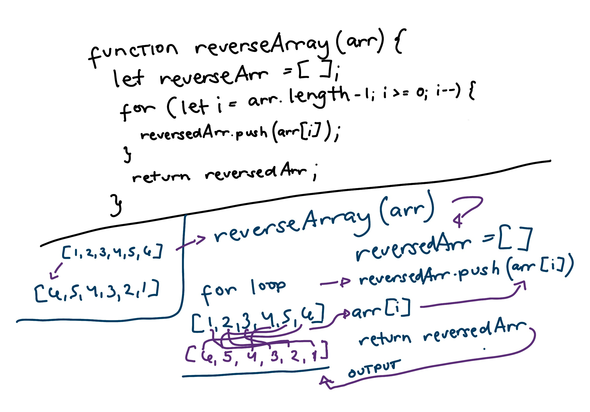

## Approach & Efficiency

- Approach: The approach taken is an iterative one, which reverses an array by creating a new array and adding elements from the input array in reverse order.

- Why: This approach was chosen because it adheres to the challenge requirement of not using built-in methods and is straightforward to implement.

- Big O Time Complexity: The time complexity is O(n) because it iterates through the input array once, performing a constant-time operation for each element.

- Big O Space Complexity: The space complexity is also O(n) because it creates a new array to store the reversed elements, with space proportional to the size of the input array.

## Solution

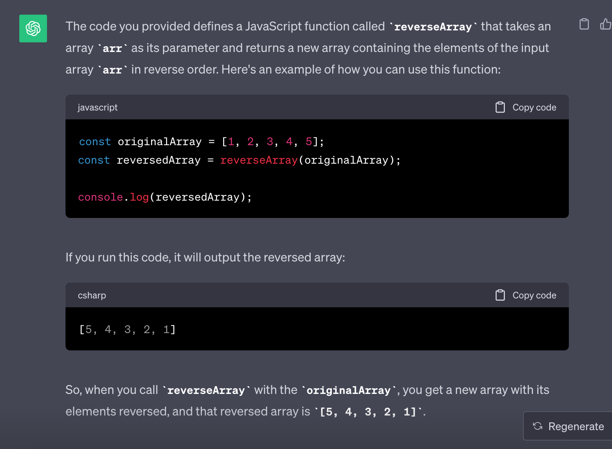

# Code 2: ArrayInsertShift

## Whiteboard Process

## Approach & Efficiency

- Approach:
  - Calculate the middle index of the input array.
  - Initialize a new result array.
  - Iterate through the original array and insert elements into the result array, adding the new value at the middle index.
  - Return the result array as the output.

- Why:
  - This approach was chosen because it allows us to insert a value into the middle of the array without using built-in methods, such as splice, which can directly add elements at a specified position.

- Big O Time Complexity:
  - Time Complexity: O(n), where n is the number of elements in the input array. We iterate through the input array once to copy its elements into the result array. The calculation of the middle index takes constant time.

- Big O Space Complexity:
  - Space Complexity: O(n) as well. We create a new result array that can potentially contain all elements of the input array plus one additional element (the new value). Therefore, the space required is proportional to the size of the input array. The calculation of the middle index and other variables have constant space overhead.

## Solution

# Code 3: BinarySearch

## Whiteboard Process

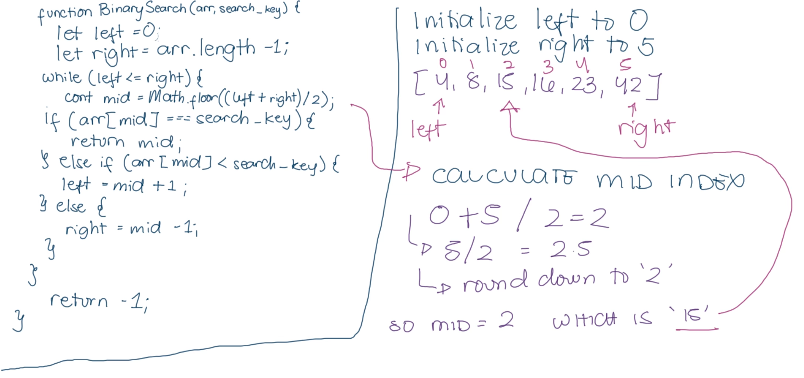

## Approach & Efficiency

- Approach:
  - The approach taken here is the Binary Search algorithm.

- Why:
  - This algorithm is used because it efficiently searches a sorted array by repeatedly dividing the search space in half, reducing the time complexity significantly compared to linear search.

- Big O Time Complexity:
  - Binary search efficiently narrows down the search space by half with each comparison.

- Big O Space Complexity:
  - Binary search uses a constant amount of extra space for variables, making it space-efficient.

## Solution
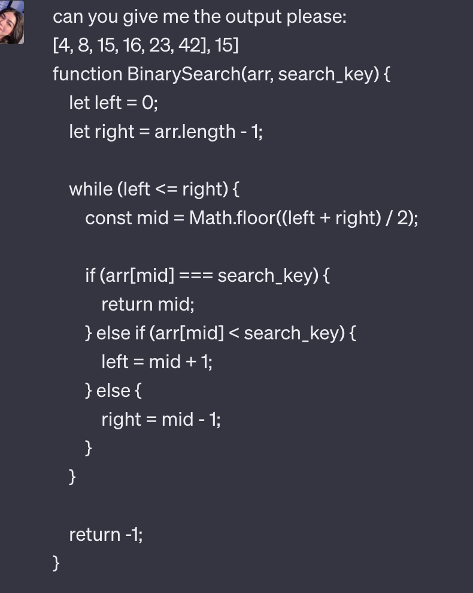
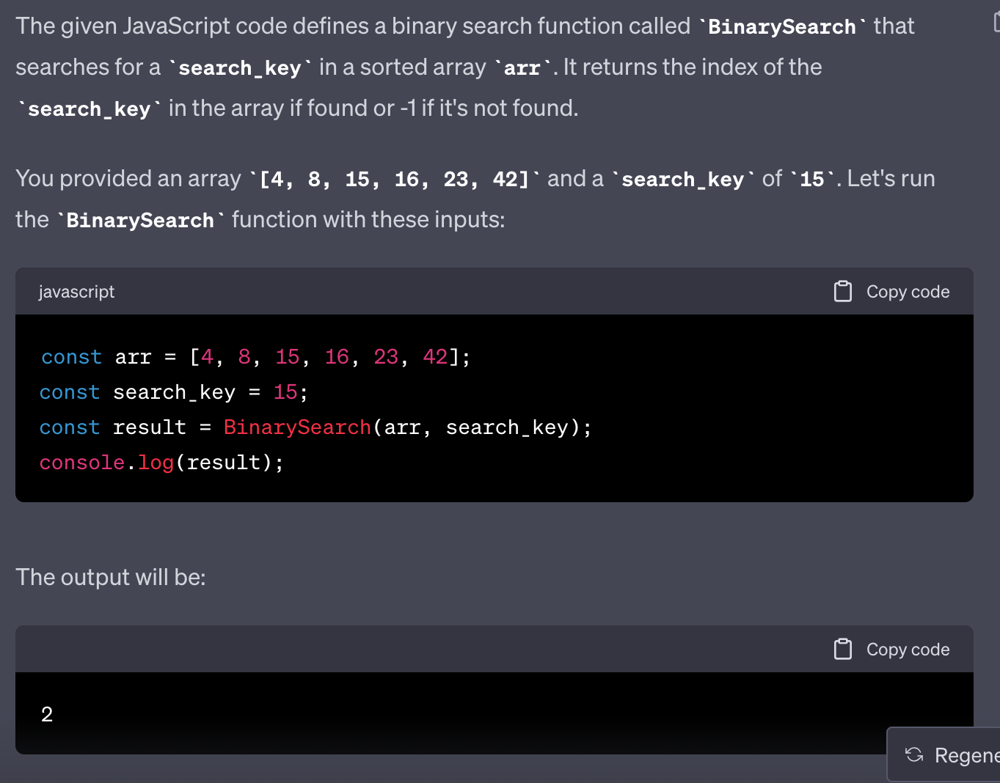

# Code 3: BinarySearch

## Whiteboard Process

## Approach & Efficiency

- Approach:
  - The approach taken here is the Binary Search algorithm.

- Why:
  - This algorithm is used because it efficiently searches a sorted array by repeatedly dividing the search space in half, reducing the time complexity significantly compared to linear search.

- Big O Time Complexity:
  - Binary search efficiently narrows down the search space by half with each comparison.

- Big O Space Complexity:
  - Binary search uses a constant amount of extra space for variables, making it space-efficient.

## Solution

# Code 5: Singly Linked Lists

## Whiteboard Process

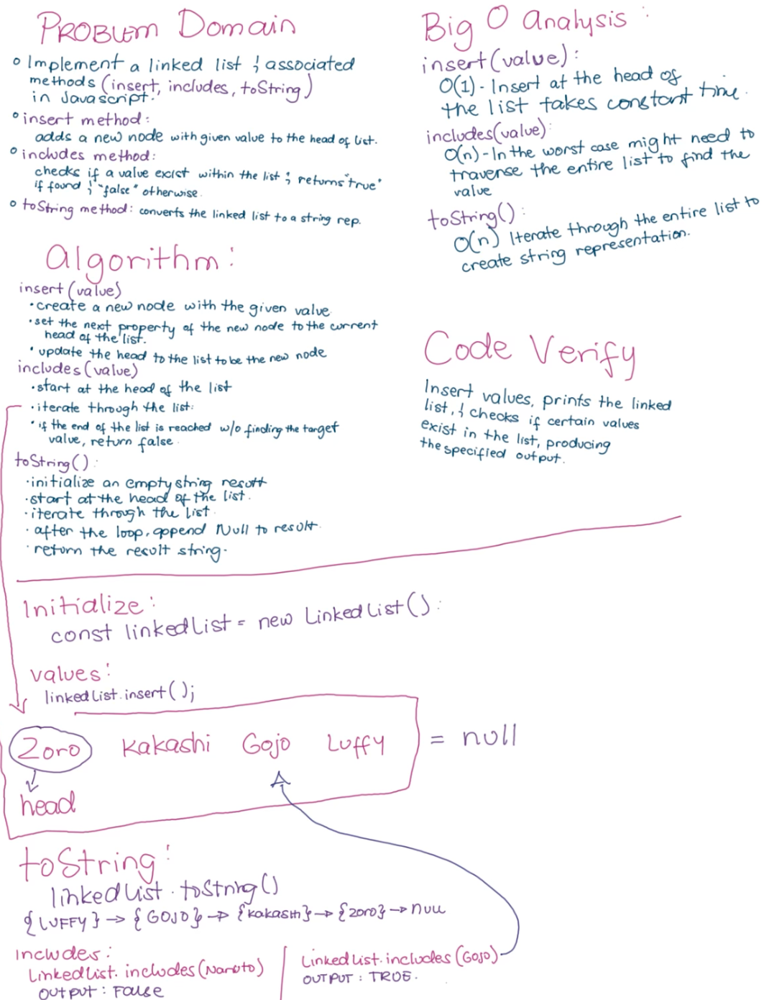

## Approach & Efficiency

- Approach:
  - LinkedList Class:
    - Implemented a singly linked list with a head property.
  - Insertion (insert method):
    - Added new nodes to the head of the list for O(1) time complexity.
  - Search (includes method):
    - Used linear search to check for value existence, resulting in O(n) worst-case time complexity.
  - String Representation (toString method):
    - Constructed a human-readable string representation of the linked list for visualization.

- Why:
  - Insertion at the Head:
    - Chose insertion at the head for O(1) time complexity.
  - Linear Search for Inclusion:
    - Linear search ensures examining each node once for value existence.
  - String Representation:
    - Built a clear and concise string for easier debugging.

- Big O Time Complexity:
  - `insert` method: O(1)
  - `includes` method: O(n) (worst-case), O(1) (best-case)
  - `toString` method: O(n)

- Big O Space Complexity:
  - The space complexity of this implementation is O(n), where n is the number of nodes in the linked list. This space is primarily used for storing the nodes themselves, and the space complexity does not depend on the number of operations performed on the linked list.

## Solution
[Code](code-challenges/LinkedList.js)
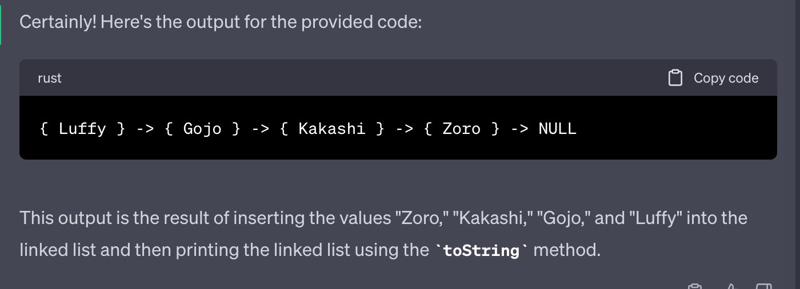

# Code 7: k-th value

## Whiteboard Process

## Approach & Efficiency

- Approach:
  The kthFromEnd method uses two pointers, a slow pointer and a fast pointer, to find the kth node from the end of the linked list. The approach involves iterating through the linked list using these pointers in a way that ensures the desired result is obtained efficiently.

  - Initialize both the slow and fast pointers to the head of the linked list.

  - Move the fast pointer k nodes ahead of the slow pointer. This is done by iterating over the list with the fast pointer.

  - After the fast pointer has been moved k nodes ahead, iterate both the slow and fast pointers simultaneously until the fast pointer reaches the end of the list. This ensures that the slow pointer will be at the kth node from the end when the fast pointer reaches the end.

  - Return the value of the node pointed to by the slow pointer, which represents the kth node from the end.

- Why:
  This approach is efficient because it requires only one pass through the linked list, with both the slow and fast pointers moving at different speeds. The fast pointer moves k nodes ahead, and then both pointers move together until the end of the list is reached. This ensures that the slow pointer is always positioned at the kth node from the end when the fast pointer reaches the end.

- Big O Time Complexity:
  The time complexity of this approach is O(n), where n is the number of nodes in the linked list. This is because we iterate through the list once, and the number of iterations is proportional to the length of the list.

- Big O Space Complexity:
  The space complexity is O(1) because we use a constant amount of extra space for the two pointers regardless of the size of thc e linked list.

## Solution
[Code](code-challenges/kthFromEnd.js)
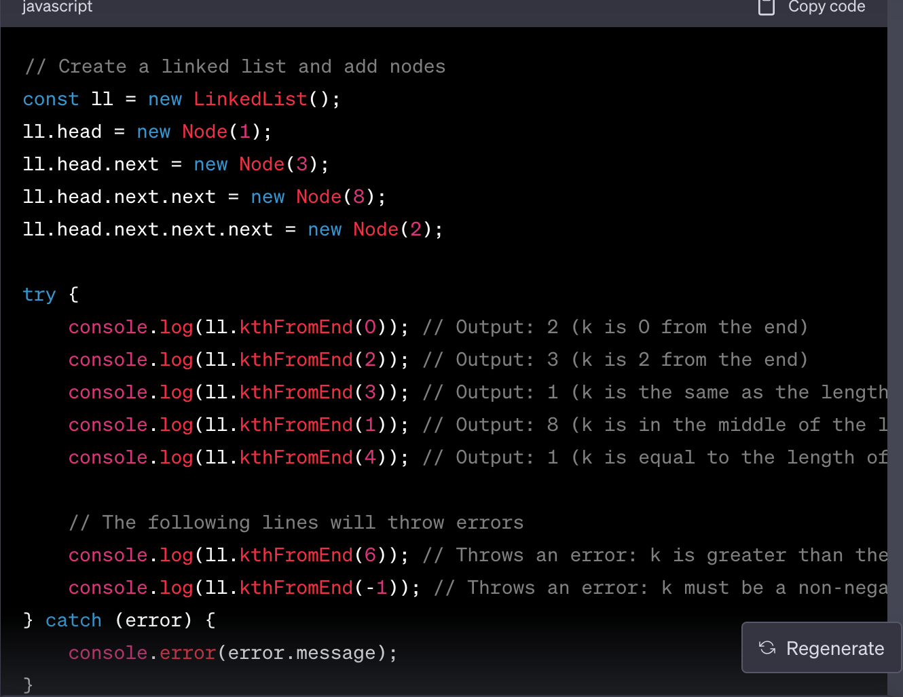

# Code 8: Zip two linked lists

## Whiteboard Process

## Approach & Efficiency

- Approach:
  1. Initialize a dummy node dummy and a current pointer to it.
  2. Use a loop that continues until either list1 or list2 is not empty.
  3. Inside the loop, if list1 has elements, attach the head of list1 to the current.next node and move list1.head to the next node.
  4. If list2 has elements, do the same for list2.
  5. This process alternates between adding nodes from list1 and list2 to the result list.
  6. Create a new LinkedList called newList with newList.head set to dummy.next, which is the merged list.
  7. Return newList.

- Why:
  This approach is used because it efficiently combines the two input lists into a new list with minimal additional space usage and a linear time complexity. It utilizes a dummy node to simplify the merging process and maintains a current pointer to build the merged list step by step. By alternating between list1 and list2, it ensures that nodes from both lists are included in the merged result, making it a straightforward and efficient way to zip two linked lists together.

- Big O Time Complexity:
  The time complexity of this zipLists function is O(N), where N is the total number of nodes in both list1 and list2. This is because the function iterates through both lists once and combines them into a new list, which takes linear time.

- Big O Space Complexity:
  The space complexity is O(1) for auxiliary space because the function does not use any additional data structures that scale with the size of the input lists. It only uses a constant amount of extra space for variables like dummy and current.

## Solution
[Code](code-challenges/zipList.js)
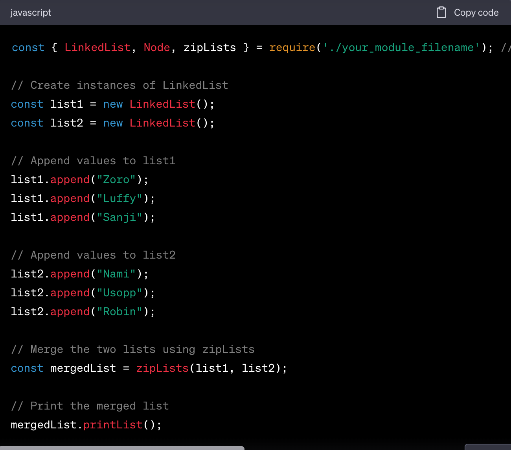
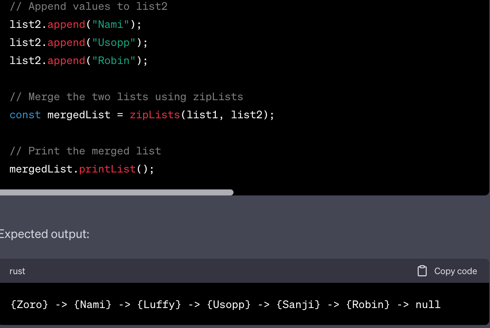

# Code 10: Stacks and Queues

## Whiteboard Process

## Approach & Efficiency

- Approach:
  Implemented using a singly linked list, where each new element is added to the rear of the queue (enqueue) and removed from the front (dequeue). This linked list approach also enables constant-time operations (O(1)) for both enqueue and dequeue.

- Why:
  Queues are commonly used for managing data in a first-in-first-out (FIFO) manner, like in task scheduling or breadth-first searches.

- Big O:
  enqueue: O(1) - Adding an element to the rear of the queue takes constant time, involving creating a new node and updating references.
  dequeue: O(1) - Removing the front element from the queue also takes constant time, as it only requires updating references.
  peek: O(1) - Peeking at the front element involves accessing the front node's value directly.
  isEmpty: O(1) - Checking if the queue is empty is a constant-time operation based on whether the front node is null or not.

## Solution
[Code](code-challenges/stacksQueue.js)
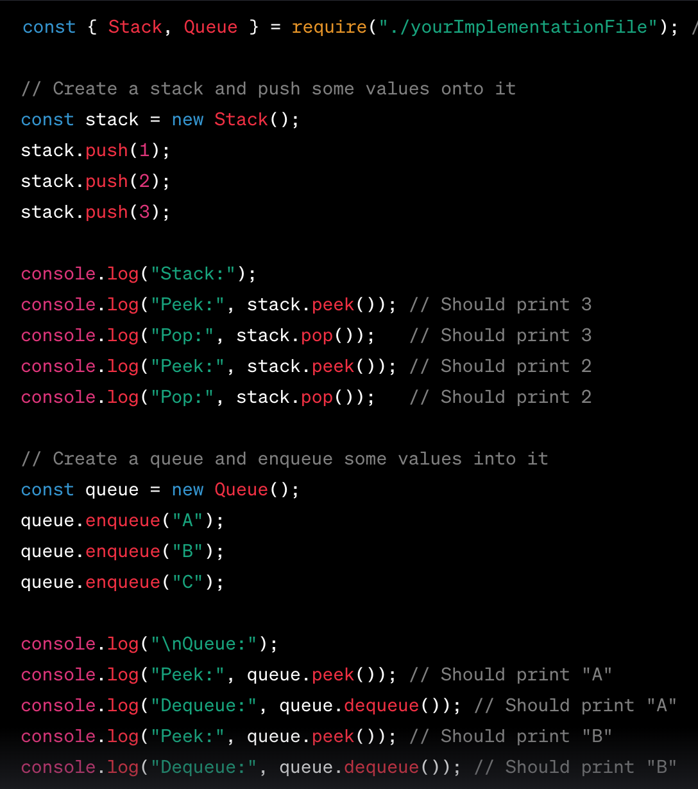
