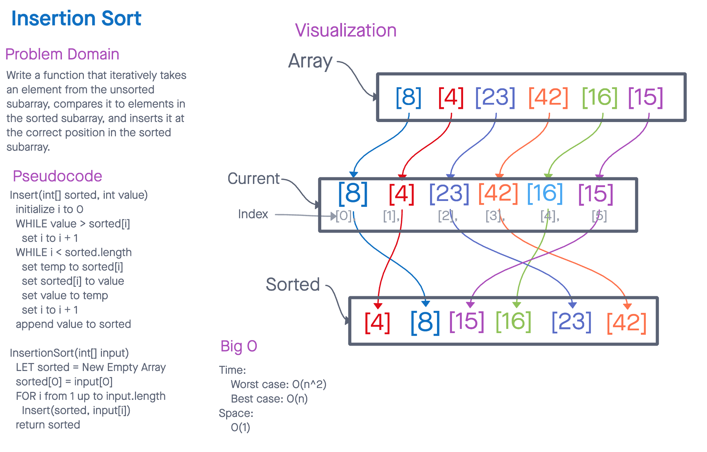

# Code 26: Insertion Sort

## Whiteboard Process

## Approach & Efficiency

- Approach:
  - The algorithm iteratively takes an element from the unsorted subarray, compares it to elements in the sorted subarray, and inserts it at the correct position in the sorted subarray.

- Why:
  - Insertion Sort is efficient for small arrays or nearly sorted arrays. It works well when the majority of elements are already in their correct positions.

- Big O Complexity:
  Time Complexity:
  - The worst-case time complexity of Insertion Sort is O(n^2), where 'n' is the number of elements in the array. This occurs when the array is in reverse order, and each element needs to be compared and moved to its correct position.
  - When the array is nearly sorted, the best-case time complexity is O(n), as the algorithm makes fewer comparisons and shifts.

  Space Complexity:
  - The space complexity of Insertion Sort is O(1), as it sorts the array in place, without using additional data structures.

## Solution
[Code](selectionSort.js)

